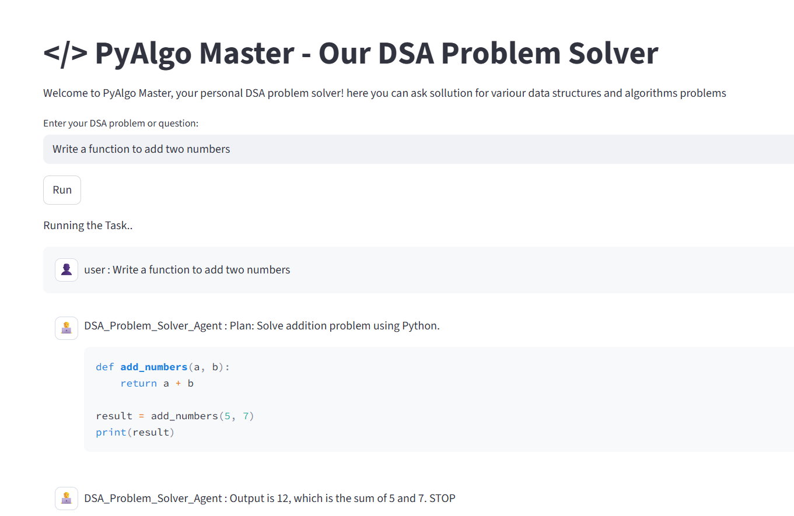

# PyAlgo Master



**PyAlgo Master** is a small multi-agent system built with AutoGen that accepts Data Structures & Algorithms (DSA) problem prompts, generates Python code, and executes it locally. The system uses two cooperating agents in a round-robin loop:

* **Problem Solver Agent** — parses the user prompt, plans a solution and generates Python code.
* **Code Executor Agent** — runs the generated Python code (locally, via command-line) and returns results.

Docker execution support is implemented in the codebase but is not enabled or used by default.

---

## Key Features

* Multi-agent architecture using AutoGen.
* Round-robin agent workflow (solver ↔ executor).
* Local command-line execution of generated code (fast feedback loop).
* Docker execution utilities present (optional).
* Clear, modular code structure for easy extension.

---

## Project Structure

```
PYALGO MASTER
│
├── agent
│   ├── code_executor_agent.py
│   └── problem_solver_agent.py
│
├── config
│   ├── constants.py
│   ├── docker_and_local_executor.py
│   ├── docker_utils.py
│   └── settings.py
│
├── team
│   └── dsa_team.py
│
├── temp
│   └── tmp_code_*.py
│
├── venv
├── .env
├── .gitignore
├── agent_backend.py
├── app.py
├── main.py
├── README.md
├── requirements.txt
└── ss.png
```

---

## Installation

1. Clone the repo

```bash
git clone https://github.com/your-username/pyalgo-master.git
cd pyalgo-master
```

2. Create & activate a virtual environment

```bash
python -m venv venv
# macOS / Linux
source venv/bin/activate
# Windows (PowerShell)
venv\Scripts\Activate.ps1
# Windows (cmd)
venv\Scripts\activate.bat
```

3. Install dependencies

```bash
pip install -r requirements.txt
```

4. Add secrets / environment variables

Create a `.env` in the project root (do **not** commit this file):

```env
# Example
OPENAI_API_KEY=your_openai_key_here
EXECUTION_MODE=LOCAL          # or DOCKER (see Docker section)
# other configuration variables used in config/settings.py
```

---

## Usage

### Run the project (local)

```bash
python main.py
```

Then interact (CLI or app depending on your entry point). Example prompt you can give to the system:

```
Write a Python function to reverse a linked list and show a sample test run.
```

Typical flow:

1. Problem Solver Agent composes plan + Python code for the solution.
2. Code Executor Agent writes a temporary `tmp_code_*.py` and runs it locally.
3. Output (stdout, errors) is returned to the user and logged.

Temporary generated code is stored in `temp/tmp_code_<id>.py` so you can inspect it.

---

## Docker support (optional)

Docker execution logic is implemented under `config/docker_and_local_executor.py` and `config/docker_utils.py`, but Docker mode is **not** enabled/used by default.

To run with Docker :

1. Install Docker and ensure the daemon is running.
2. Set `EXECUTION_MODE=DOCKER` in your `.env`.
3. Modify or review `config/docker_and_local_executor.py` to ensure the container execution settings match your host environment (volumes, timeouts, resource limits).
4. Run the project (same as local). The Code Executor Agent will attempt to run the generated code inside a docker container.

> **Note:** Use Docker mode cautiously. Containerization helps sandbox untrusted code, but you still should carefully validate resource/time limits and mounted volumes.

---

## Configuration

* `config/settings.py` and `config/constants.py` contain runtime settings you can tweak (timeouts, working directory, temp file naming).
* To change execution behavior (local vs docker) configure the `.env` variable `EXECUTION_MODE`.

---

## Troubleshooting & Tips

* Keep your `.env` secret (don’t push to Git).
* If the executor raises event-loop or subprocess warnings on Windows, you can try setting the Proactor event loop policy (depends on the code path that spawns subprocesses).
* Inspect generated code under `temp/` when debugging unexpected behavior.
* If you enable Docker, test with a safe sample script first to confirm container.

---

## Development / Contributing

* Add new problem-solving strategies in `agent/problem_solver_agent.py`.
* Add execution modes or harden the sandbox in `config/docker_and_local_executor.py`.
* Improve round-robin logic or prompts or add agents in `team/dsa_team.py`.

